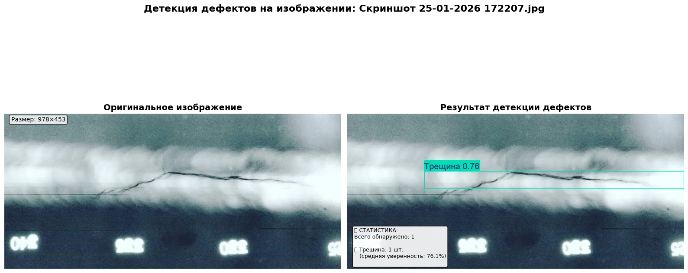

XVL — X-Ray Vision Lab

Система для автоматизированного анализа рентгеновских снимков сварных швов и детекции дефектов на базе YOLO. Проект реализует полный ML-пайплайн: от генерации синтетических данных до инференса с графическим интерфейсом.

📊 Результаты детекции
Примеры работы модели на тестовых данных:

Исходный снимок	Результат детекции
	
Реальные примеры из папки examoles демонстрируют обнаружение дефектов: трещины, поры, непровары.

🚀 Быстрый старт
1. Клонирование и установка
bash
git clone https://github.com/Passenger1993/XVL.git
cd XVL
pip install -e .
2. Загрузка весов модели
Веса обученной модели (best.pt) доступны на Hugging Face Hub:

bash
python scripts/download_weights.py
Скрипт автоматически загрузит веса в src/models/weights/.

3. Запуск приложения
bash
python src/run.py
Запустит графический интерфейс PyQt5 для интерактивного анализа.

🏗️ Структура проекта

XVL/
├── .github

│   └── workflows/                  # Обучающие данные

│       └── docker-test.yaml        # Конфигурация теста Docker

│

├── data/                          # Данные

│   ├── processed_dataset/         # Аугментированные оригиналы

│   ├── raw/                       # Оригинальные снимки

│   ├── results/                   # Примеры детекции (визуализация)

│   └── synthetic_dataset/         # Примеры синтетических фото

│   └── training/                  # Обучающие данные

│
├── docker/                        # Конфигурация Docker

├── examples/                      # Примеры

├── logs/                          # Логи

├── notebooks/                     # Jupyter-ноутбуки (эксперименты)

├── src/                           # Исходный код

│   ├── generators/                # Папка синтетической генерации

│   │   ├── core/                  # Папка синтетической генерации

│   │   ├── defects/                  # Папка синтетической генерации

│   │   ├── utils/                  # Папка синтетической генерации

│   ├── gui/                       # Графический интерфейс (PyQt5)

│   ├── model/                    # Архитектуры моделей и веса

│   │   ├── configs/                 # Логика инференса (predictor.py)

│   │   ├── inference/                 # Логика инференса (predictor.py)

│   │   ├── architectures/         # Кастомные архитектуры (yolo_custom.py)

│   │   └── weights/               # Папка для весов (.gitignore)

│   ├── trainer/                  # Скрипты обучения

│   ├── data_generation/           # Генераторы синтетических данных

│   │   ├── defects/               # Генераторы дефектов (5 классов)

│   │   ├── core/                  # Менеджер и базовые классы

│   │   └── utils/                 # Утилиты

│   └── utils/                     # Общие утилиты проекта

│

├── tests/                         # Юнит-тесты (pytest)

│   ├── data_generation/           # Тесты генераторов

│   ├── inference/                 # Тесты инференса

│   └── test_predictor.py          # Основные тесты

│

├── .dockerignore                 # Файлы вне докер-образа

├── .gitignore                    # Файлы вне гитхаб

├── .pre-commit-config.yaml       # Отладочная конфигурация

├── .LICENSE                      # Лицензия

├── pyproject.toml                # Конфигурация инструментов разработки

├── README.md                     # Текущий документ

├── requirements.txt              # Стандартные зависимости

├── requrements-dev.txt           # Зависимости для разработчиков

└── run.py                        # Точка входа

🐳 Запуск в Docker (с поддержкой GPU)

🧪 Тестирование
Проект покрыт юнит-тестами для ключевых компонентов:

bash
# Установка тестовых зависимостей
pip install -e ".[dev]"

# Запуск всех тестов
pytest tests/ -v

# Запуск тестов с покрытием кода
pytest --cov=src tests/ --cov-report=html

# Запуск тестов для конкретного модуля
pytest tests/data_generation/ -v
pytest tests/test_predictor.py -v

# Запуск в Docker
docker build -t xvl-tests -f docker/Dockerfile.test .
docker run --rm xvl-tests
Что тестируется:

Генераторы синтетических дефектов (5 классов)

Корректность работы менеджера генерации

Логика инференса (predictor)

Загрузка и сохранение моделей

🔧 Разработка
Добавление нового типа дефекта
Создайте класс-генератор в src/data_generation/defects/

Унаследуйте от BaseDefectGenerator (из src/data_generation/core/)

Зарегистрируйте в DefectManager

Добавьте тесты в tests/data_generation/

Архитектура модели
Основная модель — YOLOv8 с кастомными модификациями:

Конфигурация: configs/model_config.yaml

Архитектура: src/models/architectures/yolo_custom.py

Веса: хранятся на Hugging Face Hub, загружаются скриптом

Обучение модели
bash
# Использование Google Colab (см. notebooks/training.ipynb)
# или локальное обучение:
python src/training/train.py --config configs/training_config.yaml
📦 Конфигурация
Модель (configs/model_config.yaml)
yaml
model:
  architecture: "yolov8n"
  num_classes: 5
  pretrained: true
  input_size: [512, 512]

training:
  epochs: 100
  batch_size: 16
  learning_rate: 0.001
  device: "cuda"

🔗 Ссылки
Модель на Hugging Face Hub: huggingface.co/Alex-Watchman/XVL/xvl-model

Датасет на Kaggle: kaggle.com/datasets/your-username/welding-defects

Интерактивное демо: huggingface.co/spaces/Alex-Watchman/xvl-demo

📄 Лицензия
Проект распространяется под лицензией MIT. Подробнее см. LICENSE.

XVL — инструмент для инженеров по качеству и исследователей в области неразрушающего контроля. Система снижает зависимость от ручного анализа и повышает точность детекции дефектов сварных швов.

📊 Результаты обучения
Модель YOLOv8 показала следующие результаты:
Метрика	Значение	Эпоха
Precision	95.6%	37
Recall	88.9%	39
mAP@50	93.3%	39
mAP@50-95	78.8%	37
Ключевые выводы:
Модель достигает высокой точности детекции (95.6%)

Хорошая полнота обнаружения дефектов (88.9%)

Обучение стабилизировалось к 30-й эпохе

Наилучший баланс метрик достигнут на 37-й эпохе
